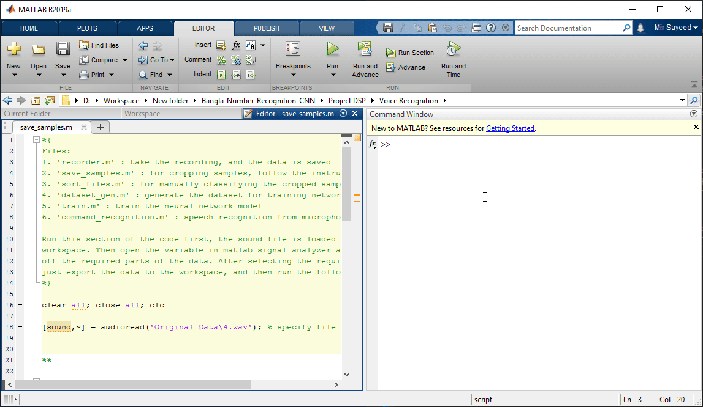
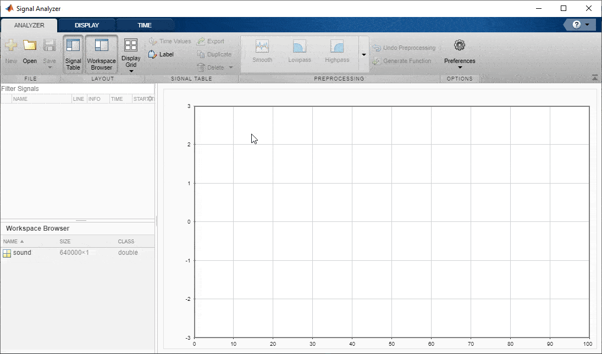

## Training the Network for Number Recognition

- <b>"recorder.m"</b> 
This file takes audio recording. The sampling rate has been set to 16 KHz and 16 bits per sample. An audiorecorder object is initialized and a directory named "Original Data" is created to save the audio files to. Recordtime has been set as 40 seconds. Use this file to record audio samples as necessary.

- <b>"save_samples.m"</b>
Used to crop recorded audio into useful data samples. The script reads an audio from the "Original Data" folder. The program has to be run sectionwise, and MATLAB signal analyzer app has to be used to crop data.

After cropping various samples from entire clip, variables have to be exported to the matlab workspace, and then the second section is run to save the samples individually to a directory called "Cropped Data".

- <b>"sort_files.m"</b>
This file takes a source folder from the previous section ("Cropped Data") and a destination folder "Dataset_sorted" where subdirectories are present for data classes. Then each audio clip from the source folder is read and output though the speaker, and user input is required through the command window to specify which class they belong to. Entering a number sends an audio clip to the folder of the intended class.

- <b>"dataset_gen.m</b>
This file combines all the sorted audio clips and puts them together in a .mat file. This .mat file is used to train the network.

- <b>"train.m</b>
Specify the dataset you want to train on, and then run this code sectionwise. The code starts training on the dataset, and later tests the results. Finally, the test accuracy is printed, and the trained network is saved as "trained.mat"

- <b>"command_recognition.m"<b>
This file loads the trained network, starts a gui and takes voice input from microphone. If a number is detected, the corresponding English digit is displayed.

